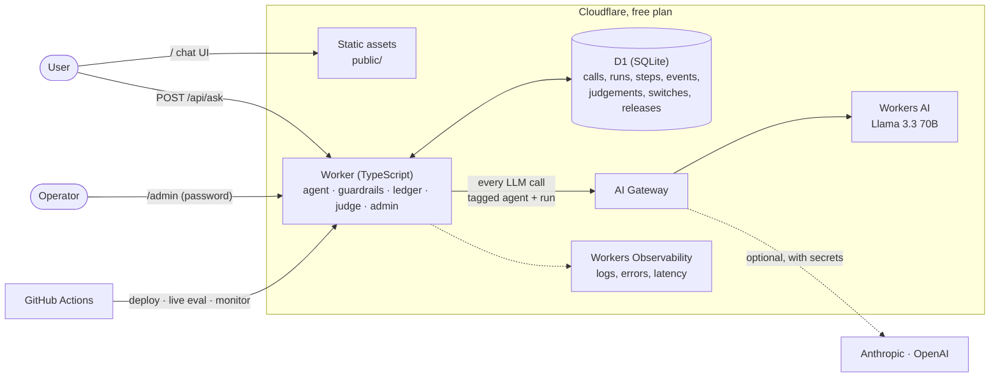
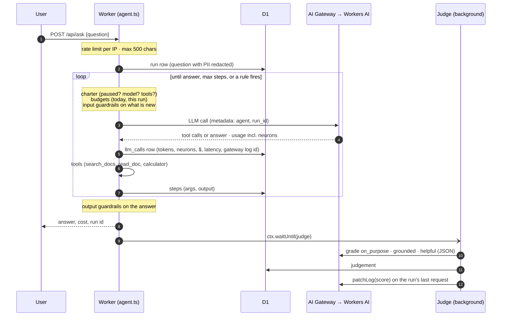
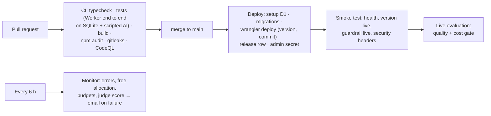

# Architecture

LLMOps Platform is one **Cloudflare Worker** on the free plan that runs an
LLM agent in production and answers, for that agent, the questions an LLMOps
team has to answer:

| Discipline | Question | Where the answer lives |
|---|---|---|
| **FinOps** | What does each call, run and day cost, and can it overspend? | `llm_calls` (D1), budgets in `config/agents.json`, AI Gateway analytics, `/admin` |
| **Scoring** | Are the answers right, and how do we know? | Deterministic eval suite (deploy gate), LLM judge, human labels |
| **Guardrails** | What may the agent do, and what is refused? | Charter in `config/agents.json`, `src/governance.ts`, `guardrail_events` |
| **DevOps** | What is deployed, did it work, is it healthy? | CI, deploy workflow, `deployments`, `/version`, monitor workflow, Workers Observability |
| **DevSecOps** | Is the code, the supply chain and the live service safe? | npm audit, gitleaks, CodeQL, Dependabot, least-privilege token, admin auth, security headers |

Decisions and their trade-offs: [ADRs](adr/README.md) · Operating it: [Runbook](runbook.md)

## 1. Components

```mermaid
flowchart LR
    user([User]) -->|"/  chat UI"| assets[Static assets<br/>public/]
    user -->|"POST /api/ask"| worker
    admin([Operator]) -->|"/admin (password)"| worker
    subgraph cf[Cloudflare, free plan]
        assets
        worker["Worker (TypeScript)<br/>agent · guardrails · ledger · judge · admin"]
        worker <--> d1[("D1 (SQLite)<br/>calls, runs, steps, events,<br/>judgements, switches, releases")]
        worker -->|"every LLM call<br/>tagged agent + run"| gw[AI Gateway]
        gw --> wai[Workers AI<br/>Llama 3.3 70B]
        obs[Workers Observability<br/>logs, errors, latency]
        worker -.-> obs
    end
    gw -.->|optional, with secrets| paid[Anthropic · OpenAI]
    gh[GitHub Actions] -->|"deploy · live eval · monitor"| worker
```

| Component | Role | Why |
|---|---|---|
| Worker | Everything that is ours: the agent loop, the rules, the ledger, the judge, the admin pages | One deployable unit, no server to operate ([ADR 0001](adr/0001-cloudflare-worker.md)) |
| D1 | The ledger: one row per call, run, step, guardrail hit, grade and release | SQL for FinOps questions; budgets need exact sums the gateway does not enforce |
| AI Gateway | Per-request analytics, tokens, cost and logs in the Cloudflare dashboard, plus the place where judge scores and human feedback are attached to each request | Native, free, nothing to build ([ADR 0002](adr/0002-ai-gateway-and-own-ledger.md)) |
| Workers AI | The model (free daily allocation of 10,000 neurons) | No API key; Anthropic or OpenAI are a configuration change |
| Workers Observability | Worker logs, exceptions and latency | Enabled in `wrangler.jsonc`, no code |

## 2. A question, end to end

```mermaid
sequenceDiagram
    autonumber
    participant U as User
    participant W as Worker (agent.ts)
    participant DB as D1
    participant G as AI Gateway → Workers AI
    participant J as Judge (background)

    U->>W: POST /api/ask {question}
    Note over W: rate limit per IP · max 500 chars
    W->>DB: run row (question with PII redacted)
    loop until answer, max steps, or a rule fires
        Note over W: charter (paused? model? tools?)<br/>budgets (today, this run)<br/>input guardrails on what is new
        W->>G: LLM call (metadata: agent, run_id)
        G-->>W: tool calls or answer · usage incl. neurons
        W->>DB: llm_calls row (tokens, neurons, $, latency, gateway log id)
        W->>W: tools (search_docs, read_doc, calculator)
        W->>DB: steps (args, output)
    end
    Note over W: output guardrails on the answer
    W-->>U: answer, cost, run id
    W-)J: ctx.waitUntil(judge)
    J->>G: grade on_purpose · grounded · helpful (JSON)
    J->>DB: judgement
    J->>G: patchLog(score) on the run's last request
```

All the rules live in one function, `runAgent` in [src/agent.ts](../src/agent.ts):
there is no other code path to the model, so nothing can skip them.

## 3. FinOps

- **Exact cost per call.** Workers AI returns the neurons each call used;
  cost = neurons × $0.011 / 1,000 (what it would cost beyond the free tier).
  Paid models are priced per token from [config/pricing.json](../config/pricing.json).
- **Budgets that stop spending**, per agent, from
  [config/agents.json](../config/agents.json): `daily_budget_usd` and
  `max_run_cost_usd`. Checked before every call; a run that hits one ends
  as `killed / daily_budget` or `killed / run_cost_limit`. The defaults
  (research agent $0.08 + judge $0.02 a day ≈ 9,000 neurons) keep the whole
  platform inside the free allocation, so it is never billed.
- **Rate limit** of 10 questions per minute per IP protects the allocation
  from a single client.
- **Where to look:** `/admin` (today's spend, share of the free allocation,
  cost per day, cost per run, budget used per agent) and the AI Gateway
  dashboard (requests, tokens, cost, logs per request).

## 4. Scoring

Three layers, from cheapest and most trusted to most informative:

| Layer | What | Blocks? |
|---|---|---|
| **Deterministic evals** | 8 handbook questions with checkable answers ([evaluation/tasks.json](../evaluation/tasks.json)): expected number or keywords. Run on the live Worker after every deploy; fails if the pass rate or the average cost per task breaks [evaluation/baseline.json](../evaluation/baseline.json) | Yes: the deploy run turns red |
| **LLM judge** | A sample of real runs graded 1-5 on *on purpose*, *grounded*, *helpful* ([src/judge.ts](../src/judge.ts)), in the background. Score also attached to the AI Gateway log of the request | No: informs and alerts (monitor) |
| **Human labels** | 👍 / 👎 on judged runs in `/admin`; *judge / human agreement* measures how far to trust the judge. Sent to AI Gateway as feedback | — |

Measured on the real model while building it: Llama 3.3 70B passes 6 of 8
tasks (it sometimes forgets a factor in a calculation), and the run-to-run
variation is real: different tasks fail on different runs. Hence a 75 %
minimum, not 100 %. The judge (same model family) caught one wrong total and
missed another: it is lenient on arithmetic, which is exactly why it informs
and the deterministic suite gates.

## 5. Guardrails

| Rule | Kind | Mode |
|---|---|---|
| `agent_paused` | Operator pressed *pause* in `/admin` | always enforced |
| `model_not_allowed`, `tool_not_allowed`, `unknown_agent` | Charter in `config/agents.json` | always enforced |
| `daily_budget`, `run_cost_limit` | Budgets | always enforced |
| `loop_detected` | Same tool, same arguments, 3 times | always enforced |
| `pii_email`, `pii_phone`, `pii_card` (Luhn-checked), `pii_iban` | Personal data in the question, tool results or answer | `monitor` logs, `enforce` blocks |
| `prompt_injection` | Known phrases in the question or in tool results (indirect injection) | `monitor` / `enforce` |

Personal data is never stored: questions and answers are saved redacted and
events keep only the last four characters. The detectors are regular
expressions and a phrase list: predictable and readable, they catch accidents
rather than a determined attacker ([ADR 0004](adr/0004-guardrails-in-the-call-path.md)).
AI Gateway also offers Llama Guard based guardrails that can be switched on
in its dashboard as an extra layer.

## 6. DevOps

```mermaid
flowchart LR
    pr[Pull request] --> ci["CI: typecheck · tests (Worker end to end<br/>on SQLite + scripted AI) · build ·<br/>npm audit · gitleaks · CodeQL"]
    ci --> merge[merge to main]
    merge --> dep["Deploy: setup D1 · migrations ·<br/>wrangler deploy (version, commit) ·<br/>release row · admin secret"]
    dep --> smoke["Smoke test: health, version live,<br/>guardrail live, security headers"]
    smoke --> ev["Live evaluation:<br/>quality + cost gate"]
    cron["Every 6 h"] --> mon["Monitor: errors, free allocation,<br/>budgets, judge score → email on failure"]
```

- **Version and commit** are injected at deploy (`--var`), shown on
  `/version` and `/admin`, and every deploy adds a row to `deployments`.
- **Rollback:** `npx wrangler rollback` returns to the previous version.
- **Alerting:** the monitor workflow fails (and GitHub emails the owner)
  when the error rate passes 10 %, the free allocation or a budget passes
  80 %, or the judge score falls under 0.6.

## 7. DevSecOps

| Control | Where |
|---|---|
| Vulnerable dependencies fail CI (`npm audit --audit-level=high`) | `ci.yml` |
| Committed secrets fail CI (gitleaks, full history) | `ci.yml` |
| Static analysis (CodeQL, weekly and on PRs) | `codeql.yml` |
| Dependency and action updates (Dependabot) | `.github/dependabot.yml` |
| Least-privilege deploy token; workflows with `contents: read` | `deploy.yml`, `.env.example` |
| Secrets only as Worker / GitHub secrets, never in the repo | `wrangler secret put` |
| Admin behind a password (constant-time check), off when unset; cross-site POSTs refused (CSRF) | `src/security.ts` |
| CSP without inline scripts, no framing, HSTS, nosniff; model output always escaped | `src/security.ts`, `public/_headers`, `public/app.js` |
| Input limits, rate limit, budgets (abuse = cost) | `src/index.ts`, `config/agents.json` |
| PII redacted at rest | `src/governance.ts` |
| Errors logged to Observability, never returned to the client | `src/index.ts` |

## 8. Configuration

| File | Owns |
|---|---|
| `wrangler.jsonc` | Bindings (AI, D1, assets, rate limit), provider and models |
| `config/agents.json` | Agent charters: purpose, models, tools, guardrail mode, judge sampling, budgets |
| `config/pricing.json` | Neuron price and free allocation; per-token prices of paid models |
| `evaluation/tasks.json`, `evaluation/baseline.json` | Eval suite and its gate |
| `migrations/` | D1 schema |
| `VERSION` | Release version shown live |

## 9. What the free plan does not give us

- **No Grafana / Prometheus / Tempo.** Dashboards are `/admin` (ours) plus AI
  Gateway and Workers Observability (Cloudflare's); there are no custom
  distributed traces beyond what Workers Observability records.
- **AI Gateway Evaluations are deprecated**, so scoring is ours; the gateway
  keeps only the score and feedback we attach to each log.
- **No spend caps in AI Gateway**: budgets are enforced in the Worker.
- **Workers AI cost is a valuation** (neurons × list price); within the free
  allocation nothing is billed, and there is no invoice to reconcile.
- **The judge's log annotation is best effort**: the binding exposes only the
  log id of its latest call, so under heavy concurrency it can attach to a
  neighbour's request.
- **No multi-user access control** on `/admin`: one shared password.
  Cloudflare Access (free up to 50 users) in front of `/admin/*` is the next step.
